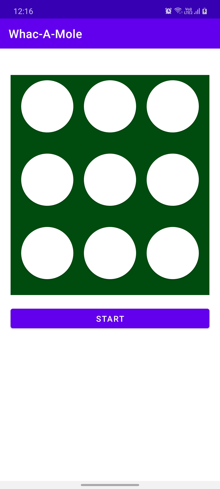
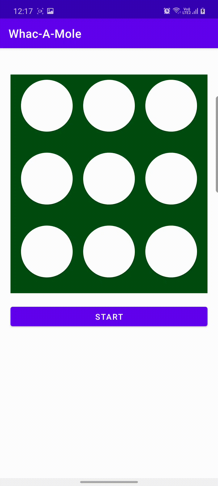

# Whac-A-Mole

A simple app to simulate the [Whac-A-Mole](https://en.wikipedia.org/wiki/Whac-A-Mole) game. The app is built in Java.

### Project setup
To setup the project in your machine

- Clone the repo

```console
foo@bar:~$ git clone https://github.com/tirgei/Whac-A-Mole.git
```

You can then import the project to your Android Studio and run it.

### Screenshots & Gameplay

|  |  |